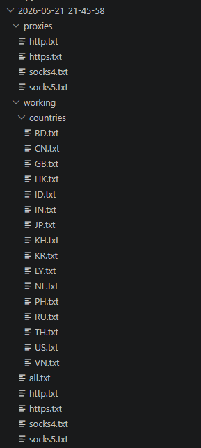

# Proxy Scraper & Checker
## Showcase

## Installation
```bash
pip install -r requirements.txt
```
## Usage
Run `main.py` and select an option from the menu.
```
python main.py
```
## Support
Join our Discord server for support and updates: [Discord Link](https://discord.gg/jWdvghHGj7)
